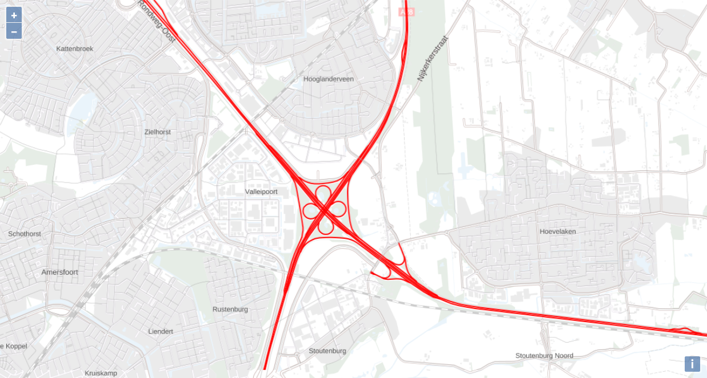
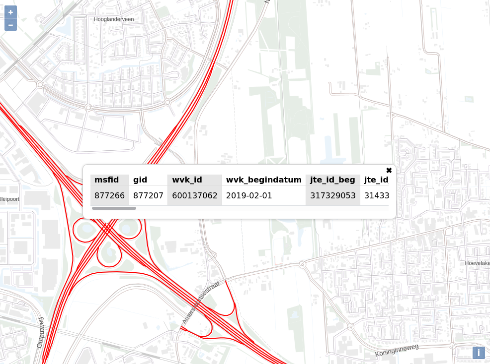

<!-- TITLE: PDOK Webservices Workshop -->

<div style="background-color:#1A1E4F;padding:1em; border-radius: 3px;">
[](https://pdok.nl)
</div>


<!-- TOC -->

- [Introduction](#introduction)
- [PDOK and Webservices](#pdok-and-webservices)
    - [Finding and Discovery Service](#finding-and-discovery-service)
        - [PDOK website](#pdok-website)
        - [PDOK viewer](#pdok-viewer)
        - [PDOK Services Plugin QGIS](#pdok-services-plugin-qgis)
        - [Nationaalgeoregister](#nationaalgeoregister)
    - [OGC Web Services (OWS)](#ogc-web-services-ows)
    - [Web Map Service (WMS)](#web-map-service-wms)
    - [Web Map Tile Service (WMTS)](#web-map-tile-service-wmts)
    - [Web Feature Service (WFS)](#web-feature-service-wfs)
    - [Catalogue Service for the Web (CSW)](#catalogue-service-for-the-web-csw)
- [Workshop](#workshop)
    - [Setting up NPM Project with OpenLayers](#setting-up-npm-project-with-openlayers)
        - [Install dependencies and setup ESLint](#install-dependencies-and-setup-eslint)
        - [First web map with OpenLayers](#first-web-map-with-openlayers)
    - [Adding Base Map Layer](#adding-base-map-layer)
    - [Adding WMS Layer](#adding-wms-layer)
        - [Adding WMS Layer to Viewer](#adding-wms-layer-to-viewer)
        - [Adding Featureinfo on Click to Viewer](#adding-featureinfo-on-click-to-viewer)
    - [Adding a GeoJSON Layer](#adding-a-geojson-layer)
        - [Data Preprocessing](#data-preprocessing)
        - [Adding GeoJSON as a Layer](#adding-geojson-as-a-layer)
    - [Using the PDOK Location Server](#using-the-pdok-location-server)
        - [Adding Custom Control](#adding-custom-control)
        - [Get Suggestions from Locatie Server](#get-suggestions-from-locatie-server)
        - [Get Result from Locatie Server](#get-result-from-locatie-server)

<!-- /TOC -->


<a id="markdown-introduction" name="introduction"></a>

# Introduction

> A VirtualBox image has been prepared with all the required software for this workshop pre-installed. You can download it [here](https://www.dropbox.com/sh/6j3e40thy9pspoi/AACS2NCHaT0h8JbKLTDSpZx9a).

In this workshop you will build a web application with an interactive map using the PDOK (map) services. The web application is build with OpenLayers version 6.2.1, an Open Source JavaScript library.

While building the web application you will learn the difference between the different geo-service types PDOK is providing, such as WMS, WMTS, WFS and WCS. Chapter [PDOK and Webservices](#pdok-and-webservices) provides a general introduction on PDOK and the different webservices. 

If you want to dive head first in the hands-on part of the workshop go immediately to the [workshop](#workshop).


<a id="markdown-pdok-and-webservices" name="pdok-and-webservices"></a>

# PDOK and Webservices

[Publieke Dienstverlening op de Kaart](https://www.pdok.nl/) (PDOK) is the geographical open data platform of the Dutch government. PDOK provides geo web services for many Dutch governmental organizations, for instance Kadaster, CBS, RIVM, Rijkswaterstaat and many more. 

Due to the [open standards policy](https://www.digitaleoverheid.nl/overzicht-van-alle-onderwerpen/standaardisatie/open-standaarden/) of the Dutch government, PDOK is using many open standards. Open standard contribute to interoperability and prevent vendor lock-in, this is important since many of the users of the PDOK services are governmental organizations themselves.

Many of the standards used by PDOK concern the web service interfaces, but PDOK also uses a range of different file format standards. For instance for how data providers need to encode their data for delivering to PDOK. Most of these standards are specific for the geographical domain and originate from the [Open GeoSpatial Consortium](https://en.wikipedia.org/wiki/Open_Geospatial_Consortium) (OGC). The OGC is a non-governmental, industry members organization. Members include big corporations such as Google and ESRI, but also governmental agencies. Members of the OGC cooperate on the development of geospatial open standards. The OGC is very much like the World Wide Web Consortium (W3C), but instead of standards for the web, it makes standards for geospatial. 

The traditional standards for geospatial web services are:

- [Web Map Service](https://en.wikipedia.org/wiki/Web_Map_Service) (WMS) - serves out maps
- [Web Map Tile Service](https://en.wikipedia.org/wiki/Web_Map_Tile_Service) (WMTS) - serves out map-tiles
- [Web Feature Service](https://en.wikipedia.org/wiki/Web_Feature_Service) (WFS) - serves out vector data (also know as features)
- [Web Coverage Service](https://en.wikipedia.org/wiki/Web_Coverage_Service) (WCS) - serves out raster data (also known as coverages)
- [Catalogue Service for the Web](https://en.wikipedia.org/wiki/Catalogue_Service_for_the_Web) (CSW) - serves out metadata from the catalogue (metadata describes data sets and/or services)

PDOK uses all these service standards to make geospatial data accessible over the web. These standards are traditional since these standards are already relatively old (initial release WMS 1999!). The OGC is working hard on developing a new set of standards, based on RESTful principles, with [OpenAPI Specifications](https://en.wikipedia.org/wiki/OpenAPI_Specification), following current best practices. This initiative is called the [OGC APIs](https://www.ogc.org/blog/2996). The development of these standards is work in progress. Also PDOK is involved with the development of this standard by building an OGC API Features [implementation](https://github.com/PDOK/wfs-3.0) (formerly known as WFS 3.0).

Another important (relatively new) mapping technology not mentioned yet is vector tiling. This technology has been around for a while, but unfortunately has not been captured yet in one of the OGC standards. Today everybody pretty much does what Mapbox does, since Mapbox developed most of this technology. Mapbox did publish the [Mapbox Vector Tile Specification](https://github.com/mapbox/vector-tile-spec) as an open standard and considering the widespread use we can say that it is a *de facto* standard. However it lacks the authority of the OGC to make it a *de jure* standard, which in the context of PDOK and the open standards policy of the Dutch government is deemed quite important. Mapbox [provides](https://docs.mapbox.com/vector-tiles/reference/) an excellent introduction on vector tiles. Main advantage of using vector tiles is that it provides a superior user experience, since it allows for dynamic styling and improved interaction with the objects on the map, since vector tiles contain the actual [feature](https://en.wikipedia.org/wiki/Geographical_feature#Cartographic_features) data. 

<a id="markdown-finding-and-discovery-service" name="finding-and-discovery-service"></a>

## Finding and Discovery Service

So PDOK hosts many services that publish geographic data, but how does one find the right data set and services? There are a number of different ways to go about it:

<a id="markdown-pdok-website" name="pdok-website"></a>

### PDOK website

PDOK website at [pdok.nl/datasets](https://www.pdok.nl/datasets). Every service PDOK publishes has a data set page on the PDOK website. The data set page contains a description and links to the service endpoints.

<a id="markdown-pdok-viewer" name="pdok-viewer"></a>

### PDOK viewer

PDOK viewer at [pdok.nl/viewer](https://www.pdok.nl/viewer). Almost all services that have a view service (WMS, WMTS, TMS) are listed in the PDOK Viewer. At the moment there is no search functionality in the viewer, so finding the right data set is not so easy. 

<a id="markdown-pdok-services-plugin-qgis" name="pdok-services-plugin-qgis"></a>

### PDOK Services Plugin QGIS

[PDOK Services Plugin for QGIS](https://plugins.qgis.org/plugins/pdokservicesplugin/). The PDOK Services Plugin for QGIS use the [CSW](#nationaalgeoregister-and-catalogue-service-for-the-web-csw) service of the NGR to collect all services PDOK hosts and make them accessible in QGIS. I can highly recommend using this plugin. Plugin is Open Source is not build or maintained by PDOK or Kadaster, but is endorsed, see the source code [repository](https://github.com/rduivenvoorde/pdokservicesplugin). To open the PDOK Services plugin click the orange button in QGIS . 


> **NOTE:** Comes pre-installed on the provided VirtualBox image

<a id="markdown-nationaalgeoregister" name="nationaalgeoregister"></a>

### Nationaalgeoregister

[nationaalgeoregister.nl](https://nationaalgeoregister.nl/) (NGR) is the Dutch national geo-portal, where open geospatial data sets are published by (mostly) public sector organizations. The NGR also contains data sets and services that are not provided by PDOK. Beside the web-interface NGR also provides API to search the catalogue programmatically, the service protocol of this API is [CSW](#catalogue-service-for-the-web-csw).
 
<a id="markdown-ogc-web-services-ows" name="ogc-web-services-ows"></a>

## OGC Web Services (OWS)

The standards in the list of *traditional* service standards are also known as the OGC Web Services (OWS). In API design these service types are very similar. For instance all service types use XML to exchange message between client and server. Also you can request for each service type a Capabilities document, which describes what that particular service instance is capable of. You can request a Capabilities document by sending a HTTP GET request with the following query parameters:

```http
service={SERVICE_TYPE}&request=GetCapabilities
```

For instance for a WMS service the request looks like this:

```
https://geodata.nationaalgeoregister.nl/cbspostcode4/wms?request=GetCapabilities&service=WMS
```

> ****NOTE:**** Below for each service type a couple of typical requests are listed, this is by no means an exhaustive list of request types in respective specifications!

<a id="markdown-web-map-service-wms" name="web-map-service-wms"></a>

## Web Map Service (WMS)

[WMS](https://en.wikipedia.org/wiki/Web_Map_Service) is a service protocol for maps; a WMS serves map images rendered from geographical data and styling rules. A WMS does not serve the actual data. WMS supports the following three requests:

- GetCapabilities: capabilities document describes layer/styles/formats/request
- GetFeatureInfo: request feature info for location (optional)
- GetMap: request map image
    - request=GetMap
    - service=WMS
    - version=1.3.0
    - layers={comma separated list 1 or more layers}
    - styles={comma separated list of available layer styling}
    - crs={coordinate system}
    - bbox={minx,miny,maxx,maxy}
    - width={width of the image}
    - height={height of the image}
    - format={image format}

Example WMS GetMap HTTP GET request:

```http
https://geodata.nationaalgeoregister.nl/cbspostcode4/wms?SERVICE=WMS&VERSION=1.3.0&REQUEST=GetMap&FORMAT=image%2Fpng&TRANSPARENT=true&layers=postcode42017&CRS=EPSG%3A28992&STYLES=&WIDTH=2780&HEIGHT=929&BBOX=-937574%2C70963%2C1453670%2C870051
```

A major disadvantage of the WMS protocol is that in potential every request to server is unique, because of the combination of the extent and the size of the image requested. This makes it impossible in practice to setup a caching layer for a WMS service. Generating map images is a CPU intensive process, response times of multiple seconds are not unheard of.


<a id="markdown-web-map-tile-service-wmts" name="web-map-tile-service-wmts"></a>

## Web Map Tile Service (WMTS)

To overcome the CPU intensive on-the-fly rendering problem, application developers started using pre-rendered map tiles. Several open and proprietary schemes were invented to organize and address these map tiles. An earlier specification for this is the Tile Map Service (TMS).

The concept of map tiles and [WMTS](https://en.wikipedia.org/wiki/Web_Map_Tile_Service) is that the zoomlevels are fixed, every zoomlevel is divided in a finite number of tiles. How the zoomlevels are organized is also known as a tilematrix. Most common is the use of a tilematrix piramide, on the lowest zoomlevel (0) 1 (4^0) map tiles and on the highest zoomlevel (22) 17592186044416 (4^22) map tiles. For each zoomlevel deeper, every tile is divided in four. But the WMTS spec does allow for more complex tile matrix sets. 


WMTS specifies multiple request encoding, but to keep it simple only the key-value-pair encoding (KVP) is shown:

Requests:

- GetCapabilities: capabilities document
- GetFeatureInfo: request feature info for location (optional)
- GetTile: request map tile
    - request=GetTile
    - service=WMTS
    - version=1.0.0
    - layer={layer name}
    - style={layer style}
    - tilematrixset={tilematrixset}
    - TileMatrix={zoom level}
    - TileCol={y coordinate of tile number}
    - TileRow={x coordinate of tile number}
    - format={image format}

Example KVP WMTS GetTile HTTP GET request:

```http
https://geodata.nationaalgeoregister.nl/tiles/service/wmts?layer=brtachtergrondkaart&style=default&tilematrixset=EPSG%3A28992&Service=WMTS&Request=GetTile&Version=1.0.0&Format=image%2Fpng&TileMatrix=02&TileCol=2&TileRow=1
```


<a id="markdown-web-feature-service-wfs" name="web-feature-service-wfs"></a>

## Web Feature Service (WFS)

[WFS](https://en.wikipedia.org/wiki/Web_Feature_Service) is a service protocol that serves [features](https://en.wikipedia.org/wiki/Geographical_feature#Cartographic_features). A WFS is only concerned with vector data, for raster data there is [WCS](https://en.wikipedia.org/wiki/Web_Coverage_Service) (Web Coverage Service). Just like a WMS a WFS supports querying the data by extent, but WFS also supports more advanced filtering capabilities, for instance querying on attribute value of the data.

Requests:

- GetCapabilities: capabilities document
- GetFeature: request features
    - service=WFS
    - request=GetFeature
    - version=2.0.0
    - typename={featuretype name}
    - startindex={paging start}
    - count={number of records to return}
    - srsname={projection of returned data}
    - outputFormat={request outputformat, capabilities doc list supported formats}

Example WFS GetFeature HTTP GET request:

```http
http://geodata.nationaalgeoregister.nl/cbspostcode4/wfs?SERVICE=WFS&REQUEST=GetFeature&VERSION=2.0.0&TYPENAME=cbspostcode4:postcode42017&STARTINDEX=0&COUNT=200&SRSNAME=urn:ogc:def:crs:EPSG::28992&outputFormat=application/json
```


<a id="markdown-catalogue-service-for-the-web-csw" name="catalogue-service-for-the-web-csw"></a>

## Catalogue Service for the Web (CSW)

[CSW](https://en.wikipedia.org/wiki/Catalogue_Service_for_the_Web) is a protocol to make metadata records on geospatial resources (such as data sets and services) searchable. The word catalogue in CSW is the catalogue of metadata records. The Dutch national geo-portal is [nationaalgeoregister.nl](https://nationaalgeoregister.nl/) (NGR). Almost all open geospatial data that are published by governmental organizations are registered in the NGR. NGR also provides a CSW endpoint, which can be used to query the catalogue programmatically.

An example CSW GetRecords HTTP GET request:

```http
https://www.nationaalgeoregister.nl/geonetwork/srv/dut/csw?request=GetRecords&Service=CSW&Version=2.0.2&typeNames=gmd:MD_Metadata&constraint=keyword=%27defensie%27&constraintLanguage=CQL_TEXT&constraint_language_version=1.1.0&resultType=results
```


<a id="markdown-workshop" name="workshop"></a>

# Workshop

Before you begin with the workshop it is highly recommended to update this repository by running:

```bash
git pull
```

The workshop is divided in five sections, each sections builds on the previous section. This repository contains five sections branches, which holds a working example application for each section:

- section-1: [Setting up NPM Project with OpenLayers](#setting-up-npm-project-with-openlayers)
- section-2: [Adding Base Map Layer](#adding-base-map-layer)
- section-3: [Adding WMS Layer](#adding-wms-layer)
- section-4: [Adding a GeoJSON Layer](#adding-a-geojson-layer)
- section-5: [Using the PDOK Location Server](#using-the-pdok-location-server)


> **NOTE:** All created applications in this workshop will use the cartographic projection [*Web Mercator*](https://en.wikipedia.org/wiki/Web_Mercator_projection) `EPSG:3857`. This is the *de facto* standard in map projections for web mapping applications. Governmental organizations in the Netherlands often require the use of the [*Amersfoort/RD New*](https://nl.wikipedia.org/wiki/Rijksdriehoeksco%C3%B6rdinaten) `EPSG:28992` projection, some the map services of PDOK are only available in the *Amersfoort/RD New* projection. More information about map projections can be found on [Wikipedia](https://en.wikipedia.org/wiki/Map_projection).

q
<a id="markdown-setting-up-npm-project-with-openlayers" name="setting-up-npm-project-with-openlayers"></a>

## Setting up NPM Project with OpenLayers


<a id="markdown-install-dependencies-and-setup-eslint" name="install-dependencies-and-setup-eslint"></a>

### Install dependencies and setup ESLint


First start by modifying your profiles path in the Bash shell, edit the file `~/.profile` and add the following line:

```bash
export PATH=./node_modules/.bin:$PATH
```

Next make sure you load the changes in your profile by sourcing the profile file:

```bash
source ~/.profile
```

Then run the following commands from the root of this repository:

```bash
mkdir webapp && cd webapp
npm init -y
npm install ol
npm install --save-dev parcel-bundler eslint
```

Setting up a linter helps with detecting syntax errors and conforming to a particular style guide. This workshop uses ESLint a JavaScript linter, setup ESLint by running `eslinit --init` and answer questions with:

- How would you like to use ESLint?
    - To check syntax, find problems, and enforce code style
- What type of modules does your project use? (Use arrow keys)
    - JavaScript modules (import/export)
- Which framework does your project use?
    - None of these
- Does your project use TypeScript?
    - n
- Where does your code run?
    - Browser
- Which style guide do you want to follow?
    - Use a popular style guide
- Which style guide do you want to follow?
    - Standard: https://github.com/standard/standard
- What format do you want your config file to be in? (Use arrow keys)
    - JavaScript
- Would you like to install them now with npm?
    - y


To setup ESLint in VS Code, install the [ESLint extension](https://marketplace.visualstudio.com/items?itemName=dbaeumer.vscode-eslint) for VS Code. Then add the following to your VS Code preferences in `settings.json` (through `File>Preferences` then click icon in upper right corner to show the actual JSON): 

```js
"editor.codeActionsOnSave": {
  "source.fixAll": true
},
"eslint.workingDirectories": [ "./webapp" ]
```

This will make sure ESLint will run on save and detect the `webapp` directory as a working directory.


<a id="markdown-first-web-map-with-openlayers" name="first-web-map-with-openlayers"></a>

### First web map with OpenLayers 

Now let's start coding, create the file `index.js` in the folder `webapp` with the following content:

```js
import 'ol/ol.css'
import { Map, View } from 'ol'
import OSM from 'ol/source/OSM'
import TileLayer from 'ol/layer/Tile.js'
import {fromLonLat} from 'ol/proj'

var map = new Map({ // eslint-disable-line no-unused-vars
  target: 'map',
  layers: [
    new TileLayer({
      source: new OSM()
    })
  ],
  view: new View({
    center: fromLonLat([5.43, 52.18]),
    zoom: 8
  })
})
```

The above JavaScript file uses the [`OSM`](https://openlayers.org/en/v6.2.1/apidoc/module-ol_source_OSM-OSM.html) class to add the [standard OpenStreetMap (OSM) tile layer](https://wiki.openstreetmap.org/wiki/Standard_tile_layer).

Create the file `index.html` in the folder `webapp` with the following content:

```html
<!DOCTYPE html>
<html>

<head>
    <meta charset="utf-8">
    <title>PDOK Webservices</title>
    <style>
        html,
        body {
            height: 100%;
            margin: 0px;
        }

        #map {
            height: 100%;
        }
    </style>
</head>

<body>
    <div id="map"></div>
    <script src="./index.js"></script>
</body>

</html>
```

Replace the `scripts` element in the `webapp/package.json` file with the following:

```json
"scripts": {
    "test": "echo \"Error: no test specified\" && exit 1",
    "start": "parcel index.html",
    "build": "parcel build --public-url . index.html"
}
```

Now run the following command from the `webapp/` directory:

```npm
npm start
```

Visit [`http://localhost:1234/`](http://localhost:1234/) to view the glorious result. If correct you should see a interactive map in your browser with the default OpenLayers basemap.


<a id="markdown-adding-base-map-layer" name="adding-base-map-layer"></a>

## Adding Base Map Layer

Now you are going to add a [WMTS](#web-map-tile-service-wmts) layer to your map as basemap layer.

Replace the code in `index.js` with the following:

```js
import 'ol/ol.css'
import { Map, View } from 'ol'
import WMTSSource from 'ol/source/WMTS'
import TileLayer from 'ol/layer/Tile.js'
import WMTSTileGrid from 'ol/tilegrid/WMTS.js'
import { get as getProjection, fromLonLat } from 'ol/proj'
import { getTopLeft, getWidth } from 'ol/extent.js'

const projection = getProjection('EPSG:3857')
const projectionExtent = projection.getExtent()
const size = getWidth(projectionExtent) / 256
const resolutions = new Array(20)
const matrixIds = new Array(20)

for (let z = 0; z < 20; ++z) {
  // generate resolutions and matrixIds arrays for this WMTS
  // see https://openlayers.org/en/latest/examples/wmts.html
  resolutions[z] = size / Math.pow(2, z)
  matrixIds[z] = z
}

const baseMapLayer = new TileLayer({
  extent: projectionExtent,
  source: new WMTSSource({
    url: 'https://geodata.nationaalgeoregister.nl/tiles/service/wmts',
    layer: 'brtachtergrondkaartgrijs',
    matrixSet: 'EPSG:3857',
    format: 'image/png',
    attributions: 'Map data: <a href="http://www.kadaster.nl">Kadaster</a>',
    tileGrid: new WMTSTileGrid({
      origin: getTopLeft(projectionExtent),
      resolutions: resolutions,
      matrixIds: matrixIds
    }),
    style: 'default'
  })
})

const map = new Map({ // eslint-disable-line no-unused-vars
  layers: [
    baseMapLayer
  ],
  target: 'map',
  view: new View({
    center: fromLonLat([5.43, 52.18]),
    zoom: 8
  })
})
```


<a id="markdown-adding-wms-layer" name="adding-wms-layer"></a>

## Adding WMS Layer


Now you are going to add a [WMS](#web-map-service-wms) layer to your map as basemap layer.


<a id="markdown-adding-wms-layer-to-viewer" name="adding-wms-layer-to-viewer"></a>

### Adding WMS Layer to Viewer

Now we have good looking basemap it is time to display something on top of it.

[*NWB Wegen*](https://www.pdok.nl/introductie/-/article/nationaal-wegen-bestand-nwb-) data set which is also published as a WMS service. The *Geo Services* tab provides a [WMS service url](https://geodata.nationaalgeoregister.nl/nwbwegen/wms?request=GetCapabilities&service=wms). The URL provided links to the `capabilities` document, which describes what the service is capable of. The capabilities document lists which layers, styles, image formats and projections are available and more.

To add the `wegvakken` layer from the WMS service to the map add the following to the `index.js` document before the declaration of the `map` object.

```js
import ImageLayer from 'ol/layer/Image'
import ImageWMS from 'ol/source/ImageWMS'

const wmsSource = new ImageWMS({
  url: 'https://geodata.nationaalgeoregister.nl/nwbwegen/wms?',
  crossOrigin: 'anonymous',
  params: { LAYERS: 'wegvakken' }
})

const wsmLayer = new ImageLayer({
  extent: projectionExtent,
  source: wmsSource
})
```

Do not forget to add `wsmLayer` to the map object. We also need to set the zoomlevel of the initial view to `14` in order to see the WMS layer. This is due to the way this WMS service is configured, in the capabilities document the `wegvakken` layer has a `MaxScaleDenominator` property set to `50000`. This means that the layer is visible from scale `1:1` until `1:50000`. In terms of WMTS zoomlevels this means that layer is visible from zoomlevel `14` and up. The map object declaration should now look like this:


```js
const map = new Map({ // eslint-disable-line no-unused-vars
  layers: [
    baseMapLayer,
    wsmLayer
  ],
  target: 'map',
  view: new View({
    center: fromLonLat([5.43, 52.18]),
    zoom: 14
  })
})
```

Your map application should now display the `wegvakken` layer:



You will notice that this WMS is pretty limited in what it can do, it is hard to get a complete view of dataset with all the restrictions. In the next section we will address this issue.


<a id="markdown-adding-featureinfo-on-click-to-viewer" name="adding-featureinfo-on-click-to-viewer"></a>

### Adding Featureinfo on Click to Viewer

The WMS standard provides a mechanism to retrieve information of features, the underlying vector data of the map. The request do retrieve feature information is called `GetFeatureInfo`. The WMS specification does not require the implementation of the `GetFeatureInfo` request, therefore a client should always check in the [capabilities document](https://geodata.nationaalgeoregister.nl/nwbwegen/wms?request=GetCapabilities&service=wms) if the service support the `GetFeatureInfo` request. The NWB-wegen WMS supports the `GetFeatureInfo` request, it is listed in the `Capability/Request` element in the XML.

In this section we are going to add functionality so show a popup with feature information when a users clicks on the map. To do this add the following to the `body` element of `index.html`, before the `script.js` inclusion:

```html
<div id="popup" class="ol-popup">
    <a href="#" id="popup-closer" class="ol-popup-closer"></a>

    <div id="popup-content"></div>
</div>
```

Add the following code to `index.js` before the `map` constant declaration:

```js
import Overlay from 'ol/Overlay'

// Elements that make up the popup.
var container = document.getElementById('popup')
var content = document.getElementById('popup-content')
var closer = document.getElementById('popup-closer')

// Create an overlay to anchor the popup to the map.
var overlay = new Overlay({
  element: container,
  autoPan: true,
  autoPanAnimation: {
    duration: 250
  }
})

// Add a click handler to hide the popup.
closer.onclick = function () {
  overlay.setPosition(undefined)
  closer.blur()
  return false
}
```

Add the `overlay` constant to the `map` object:

```js
const map = new Map({ // eslint-disable-line no-unused-vars
  layers: [
    baseMapLayer,
    wsmLayer
  ],
  target: 'map',
  overlays: [overlay],
  view: new View({
    center: fromLonLat([5.43, 52.18]),
    zoom: 14
  })
})
```

Add the `singleclick` eventhandler on the map object below the `map` declaration in `index.js`:

```js
map.on('singleclick', function(evt) {
  // clean content of popup on every new singeclick event
  if (content.childNodes.length > 0) content.childNodes[0].remove()
  var viewResolution = /** @type {number} */ (map.getView().getResolution());
  var url = wmsSource.getFeatureInfoUrl(
    evt.coordinate, viewResolution, 'EPSG:3857',
    {'INFO_FORMAT': 'application/json'});
  if (url) {
    fetch(url)
      .then(function (response) { return response.json() })
      .then(function (data) {
        // set overlay position to undefined to hide popup
        if (data.features.length === 0){
          overlay.setPosition(undefined)
          return
        }
        let ft = data.features[0]
        let table = document.createElement("table")
        var header = table.createTHead()
        var row = header.insertRow()
        let i=0
        Object.keys(ft.properties).forEach(function(item){
          let cell = row.insertCell(i)
          cell.innerHTML = item
          i++
        })
        let body = table.createTBody()
        row = body.insertRow()
        i=0
        Object.keys(ft.properties).forEach(function(item){
          let cell = row.insertCell(i)
          cell.innerHTML = ft.properties[item]
          i++
        })
        content.appendChild(table)
        overlay.setPosition(evt.coordinate)
      })
  }
})
```

Create a new `index.css` file in the root of the `webapp` folder and add the following CSS:

```css
html, body {
    height: 100%;
    margin: 0px;
}


#map {
    height: 100%;
}

.ol-popup {
    position: absolute;
    background-color: white;
    box-shadow: 0 1px 4px rgba(0, 0, 0, 0.2);
    padding: 15px;
    border-radius: 10px;
    border: 1px solid #cccccc;
    bottom: 12px;
    left: -50px;
    min-width: 40vw;
    max-width: 60vw;
    padding-top: 20px;
}

.ol-popup:after, .ol-popup:before {
    top: 100%;
    border: solid transparent;
    content: " ";
    height: 0;
    width: 0;
    position: absolute;
    pointer-events: none;
}

.ol-popup:after {
    border-top-color: white;
    border-width: 10px;
    left: 48px;
    margin-left: -10px;
}

.ol-popup:before {
    border-top-color: #cccccc;
    border-width: 11px;
    left: 48px;
    margin-left: -11px;
}

.ol-popup-closer {
    text-decoration: none;
    position: absolute;
    top: 2px;
    right: 8px;
}

.ol-popup-closer:visited {
    text-decoration: inherit;
    color: inherit;
    cursor: auto;
}

.ol-popup-closer:after {
    content: "✖";
}


#popup-content {
    overflow-x: scroll;
}

table {
    border: none;
    border-collapse: collapse;
    font-family: sans-serif;
}

table td {
    border-left: 1px solid #ddd;
    border-right: 1px solid #ddd;
    padding-left: 0.5em;
    padding-right: 0.5em;
}

thead>tr>td {
    border-bottom: 1px solid #ddd;
    font-weight: 600;
}

table td:first-child {
    border-left: none;
}

table td:last-child {
    border-right: none;
}

tbody td:nth-of-type(odd), thead td:nth-of-type(odd) {
    background: #E6E6E6;
}
```

Remove the `style` element from the `index.html` file and replace with:

```html
<link rel="stylesheet" type="text/css" href="index.css">
```

Reload the webapp in the browser,now the map should display a popover when a feature is clicked on the map.



What happens in the background is that OpenLayers registers on which pixel coordinate a user clicks. This is information is combined with the query parameters of the previous WMS `GetMap` request, to create a `GetFeatureInfo` request. In the below example `GetFeatureInfo` request the user clicked on pixel coordinate `50,50` of an image with `WIDTH` and `HEIGHT` of `101,101`, [this](https://geodata.nationaalgeoregister.nl/nwbwegen/wms?SERVICE=WMS&VERSION=1.3.0&REQUEST=GetMap&FORMAT=image%2Fpng&TRANSPARENT=true&LAYERS=wegvakken&CRS=EPSG%3A3857&STYLES=&WIDTH=101&HEIGHT=101&BBOX=603781.6790671768%2C6831433.221161786%2C604746.696549277%2C6832398.238643886) is the corresponding `GetMap` request.

```http
https://geodata.nationaalgeoregister.nl/nwbwegen/wms?SERVICE=WMS&
VERSION=1.3.0&
REQUEST=GetFeatureInfo&
FORMAT=image%2Fpng&
TRANSPARENT=true&
QUERY_LAYERS=wegvakken&
LAYERS=wegvakken&
INFO_FORMAT=application%2Fjson&
I=50&
J=50&
CRS=EPSG%3A3857&
STYLES=&
WIDTH=101&
HEIGHT=101&
BBOX=603781.6790671768%2C6831433.221161786%2C604746.696549277%2C6832398.238643886
```


<a id="markdown-adding-a-geojson-layer" name="adding-a-geojson-layer"></a>

## Adding a GeoJSON Layer

A different approach to displaying geographical data is, instead of using WMS and WMTS services, downloading the vector data in the client and displaying the vector data directly. In this scenario there is no need for a server and gives you complete freedom of styling of the data. One major drawback of this approach is performance, processing power on the client is limited; there is a upper limit on the number of features you can load in your map (at once).

When rendering geographical data directly on the client rendering performance is a concern. You can optimize for this by preprocessing your data to either:

1. Reduce the size of the data set by removing features
2. Reduce the size of the data set by simplification of the geometries (aggregation, generalization)

In this workshop we only do preprocessing of the data to reduce the size of the data set. This is done by selecting only the motorways (the *A* roads) and joining the separate segments into one geometry grouped by the road letter and road number combination (for instance group by A1, A2, A348). We will use the [`ogr2ogr`](https://gdal.org/programs/ogr2ogr.html) commandline utility for data processing.


<a id="markdown-data-preprocessing" name="data-preprocessing"></a>

### Data Preprocessing

In this chapter you are going to create a map of the Dutch motor ways, directly rendered in the browser from a GeoJSON file. We will use the [NWB-wegen data set](https://www.pdok.nl/introductie/-/article/nationaal-wegen-bestand-nwb-), PDOK provides WMS en WFS services and also a direct download service. In this case we will use the PDOK download service, since we want to obtain the full data set.

> **NOTE:** If you are using the VirtualBox image that comes with the workshop you do not need to download the file, it is already downloaded in `~/pdok-webservices-workshop/data`.

First ensure your current working directory is `~/pdok-webservices-workshop` (the root folder of this project):

```bash
cd ~/pdok-webservices-workshop
```

The data we are going to use is available in the `./data` folder of this project. If needed the file can be downloaded through the following command.

```bash
curl "http://geodata.nationaalgeoregister.nl/nwbwegen/extract/nwbwegen.zip" -o data/nwbwegen.zip
```

Then unzip:

```bash
unzip data/nwbwegen.zip -d data/
```

Open the Shapefile in QGIS to inspect data from the NWB-wegen data set, Shapefile is located in `data/geogegevens/shapefile/nederland_totaal/wegvakken/wegvakken.shp`. This file can also be drag&drop in QGIS.


You will notice that it takes some processing for QGIS to render all the features when viewing the full extent of the Netherlands. This is a sure sign your browser will have a hard time rendering all this data. To make life easy for the browser we will extract only the motorways from this data set. 

Another concern is that the roads in the `wegvakken` layer from NWB-wegen are divided in many separate segments. This is not ideal for styling and labeling the in the webapp. Therefore we need to merge the geometries, and we can immediately group them by route-letter and route-number (A2, A10, A348). 

First step is to convert the shapefile to GPKG and select only the `A` routes ([GeoPackage](https://en.wikipedia.org/wiki/GeoPackage) is the superior geospatial file format, although Shapefile is [refusing](https://twitter.com/shapefiie) to go away).

```bash
ogr2ogr -f GPKG data/nwb.gpkg data/geogegevens/shapefile/nederland_totaal/wegvakken/wegvakken.shp -sql "select * from wegvakken where routeltr = 'A'" -nln wegvakken_a
```

The add a new column `route` to the wegvakken table and set the value to `routeltr+routenr`:

```bash
ogrinfo data/nwb.gpkg -sql "alter table wegvakken_a add column route TEXT"
ogrinfo data/nwb.gpkg -sql "update wegvakken_a set route=routeltr||routenr"
```

Now you are ready to group the geometries by the newly created `route` attribute and merge geometries of this group:

```bash
ogr2ogr -update -f GPKG  data/nwb.gpkg data/nwb.gpkg -sql "SELECT ST_Union(_ogr_geometry_) as geom, route FROM wegvakken_a GROUP BY route" -nln snelwegen -nlt MULTILINESTRING
```

Now convert the `snelwegen` layer in the GPKG to GeoJSON:

```bash
ogr2ogr -f GeoJSON data/snelwegen.json data/nwb.gpkg -sql "select geom, route from snelwegen" -t_srs EPSG:3857 -nln snelwegen
```

Open `snelwegen.json` in QGIS, to verify whether you see the expected output, compare it with the intermediate layers in `data/nwb.gpkg`. You can style the layer based on the `route` attribute:


Then copy the `snelwegen.json` file to the `webapp` folder.

```bash
cp data/snelwegen.json webapp/
```


<a id="markdown-adding-geojson-as-a-layer" name="adding-geojson-as-a-layer"></a>

### Adding GeoJSON as a Layer

Next we need to add some imports to the `index.js` file to display the GeoJSON file in your webapp:

```js
import Point from 'ol/geom/Point'
import { Text, Fill, Stroke, Style } from 'ol/style'
import MultiLineString from 'ol/geom/MultiLineString'
import VectorLayer from 'ol/layer/Vector'
import { getCenter } from 'ol/extent'
import { Vector as VectorSource } from 'ol/source'
import GeoJSON from 'ol/format/GeoJSON'
import snelwegen from './snelwegen.json'
```

Remove the WMS layer and the click event handler, we are going to replace these with the GeoJSON layer. 

Add the following to `index.js` **and** do not forget to add the `snelwegenLayer` to the `map` object:

```js
function styleFunc (feature) {
  const styles = [
    new Style({
      stroke: new Stroke({
        color: 'red',
        width: 5
      })
    }),
    new Style({
      stroke: new Stroke({
        color: 'white',
        width: 1
      })
    })
  ]
  styles.push(new Style({
    geometry: function (feature) {
      var multiLineString = new MultiLineString(feature.getGeometry().getCoordinates())
      // labelPoint is the closest point on the line from the center of the extent of the geometry
      var labelPoint = multiLineString.getClosestPoint(getCenter(feature.getGeometry().getExtent()))
      return new Point(labelPoint)
    },
    text: new Text({
      text: feature.get('route'),
      font: '1em sans-serif',
      stroke: new Stroke({
        color: 'green',
        width: 6
      }),
      fill: new Fill({
        color: 'white'
      }),
      overflow: true
    })
  }))
  return styles
}

const snelwegenSource = new VectorSource({
  features: (new GeoJSON(
  )).readFeatures(snelwegen)
})

const snelwegenLayer = new VectorLayer({
  source: snelwegenSource,
  style: styleFunc,
  declutter: true
})
```

> **NOTE:** you can also remove the popup div from `index.html`, in that case do not forget to also remove the `closer` variable from the `index.js` file.

Refresh your browser to see the result:


With a simple modification of the style function the labeling can be made dynamic, based on the extent of the current view, this way all features in the current view are labeled. You can replace the `var labelPoint` in the `function styleFunc`:

```javascript
var labelPoint = multiLineString.getClosestPoint(getCenter(map.getView().calculateExtent(map.getSize())))
```

However this is not an ideal solution either due to the jumping labels on panning and `zoomchange` by the user. This can off course also be solved client side, but as you may realize labeling features is not a trivial problem.

Since we have the actual vector data loaded in the viewer, it is fairly easy to highlight features that have been clicked. Add the following to `index.js`:

```js
var selection = {}

const selectionLayer = new VectorLayer({
  declutter: true,
  source: snelwegenLayer.getSource(),
  style: function (feature) {
    if (feature.get('route') in selection) {
      return new Style({
        stroke: new Stroke({
          color: 'yellow',
          width: 1.5
        })
      })
    }
  }
})

map.on(['click'], function (event) {
  const features = map.getFeaturesAtPixel(event.pixel, { hitTolerance: 3 })
  if (!features.length) {
    selection = {}
    selectionLayer.changed()
    return
  }
  const feature = features[features.length - 1]
  const identifier = feature.get('route')
  selection = {}
  selection[identifier] = feature
  selectionLayer.changed()
})
```

Do not forget to add the new `selectionLayer` to the map. Now when a feature on the map is clicked it will be highlighted.


<a id="markdown-using-the-pdok-location-server" name="using-the-pdok-location-server"></a>

## Using the PDOK Location Server

The [PDOK Locatie Server](https://github.com/PDOK/locatieserver/wiki/API-Locatieserver) might be the only PDOK service that does not implement a standardized service protocol. This probably due to the fact that there is no existing open standard for [Gazetteer](https://en.wikipedia.org/wiki/Gazetteer) services. The PDOK Locatie Server allows to query locations by text; so you could ask the location in lat/long coordinates for `Steenstraat Arnhem`. 

In this section we are going to add a input control to the map that accepts text. This text will be used to query the Locatie Server, and then display the results on the map. 


<a id="markdown-adding-custom-control" name="adding-custom-control"></a>

### Adding Custom Control

To make life easier you will install the [`autocompleter`](https://www.npmjs.com/package/autocompleter) npm dependency. This will take care of showing the list of suggestion for the input and take care of all the required event handling. 

First install the autocomplete npm dependency, from the webapp folder run: 

```
npm install autocompleter
```
Remove `popup` html elements from `index.html` and remove the `closer` variable from the `index.js` file. Then add to `index.css`:

```css
.ol-zoom.ol-control {
  top: 2em;
}
```

Now add to `index.js`:

```js
import { Control } from 'ol/control'
import WKT from 'ol/format/WKT'
import autocomplete from 'autocompleter'
import 'autocompleter/autocomplete.css'

const locatieServerUrl = 'https://geodata.nationaalgeoregister.nl/locatieserver/v3'

var LocationServerControl = /* @__PURE__ */(function (Control) {
  function LocationServerControl (optOptions) {
    var options = optOptions || {}
    var input = document.createElement('input')
    input.id = 'input-loc'
    var element = document.createElement('div')
    element.className = 'input-loc ol-unselectable ol-control'
    element.appendChild(input)
    Control.call(this, {
      element: element,
      target: options.target
    })
  }
  /* eslint no-proto: 0 */
  if (Control) LocationServerControl.__proto__ = Control
  LocationServerControl.prototype = Object.create(Control && Control.prototype)
  LocationServerControl.prototype.constructor = LocationServerControl
  return LocationServerControl
}(Control))

map.addControl(new LocationServerControl())
```

If correct the map should display an input control:


<a id="markdown-get-suggestions-from-locatie-server" name="get-suggestions-from-locatie-server"></a>

### Get Suggestions from Locatie Server

Nothing happens when you start typing in the input control. Let's change that! Add the the following to the `function LocationServerControl` below the `Control.call` section:

```js
autocomplete({
      input: input,
      fetch: function (text, update) {
        fetch(`${locatieServerUrl}/suggest?q=${text}`)
          .then((response) => {
            return response.json()
          })
          .then((data) => {
            const suggestions = []
            data.response.docs.forEach(function (item) {
              const name = item.weergavenaam
              const id = item.id
              suggestions.push({ label: name, value: id })
            })
            update(suggestions)
          })
      }
    })
```

Now the control should display the suggestions:


<a id="markdown-get-result-from-locatie-server" name="get-result-from-locatie-server"></a>

### Get Result from Locatie Server

Nothing happens when you select one of the autosuggest items, let's fix that. Add the following code below the `fetch` property in the `autocomplete` body:

```js
onSelect: function (item) {
        input.value = item.label
        const id = item.value
        fetch(`${locatieServerUrl}/lookup?id=${id}&fl=id,geometrie_ll`)
          .then((response) => {
            return response.json()
          })
          .then((data) => {
            const wktLoc = data.response.docs[0].geometrie_ll
            const format = new WKT()
            const feature = format.readFeature(wktLoc, {
              dataProjection: 'EPSG:4326',
              featureProjection: 'EPSG:3857'
            })
            const ext = feature.getGeometry().getExtent()
            map.getView().fit(ext, map.getSize())
          })
      }
```

When you click an autosuggest item, the map will zoom to the location of the selected object. This can still be improved, as you can see, the `lookup` endpoint returns a geometry of the requested object. You can make this geometry visible by creating a `VectorSource` and `VectorLayer`, add the feature to the `VectorSource` and add the `VectorLayer` to the map.  

```js
const vectorSource = new VectorSource()

const vectorLayer = new VectorLayer({
  source: vectorSource,
  declutter: true
})
```

In the promise fulfillment of the `lookup` fetch add after creating the feature form WKT:

```js
vectorSource.clear()
vectorSource.addFeature(feature)
```

Now when you select an item from the autosuggest list, the viewer will zoom to the object and display the geometry of the object on the map:


